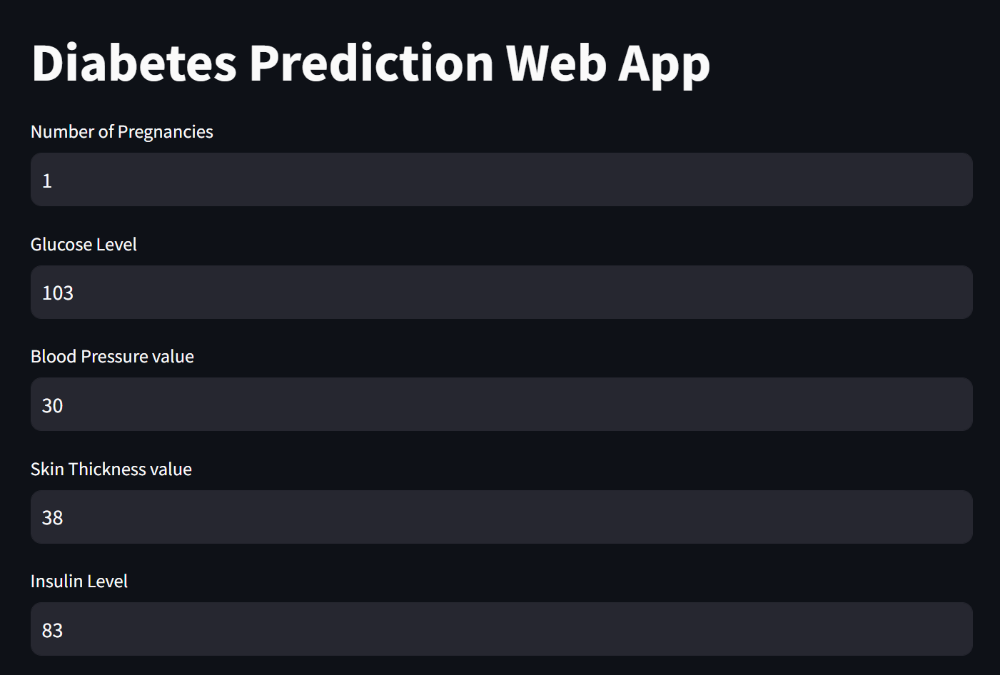
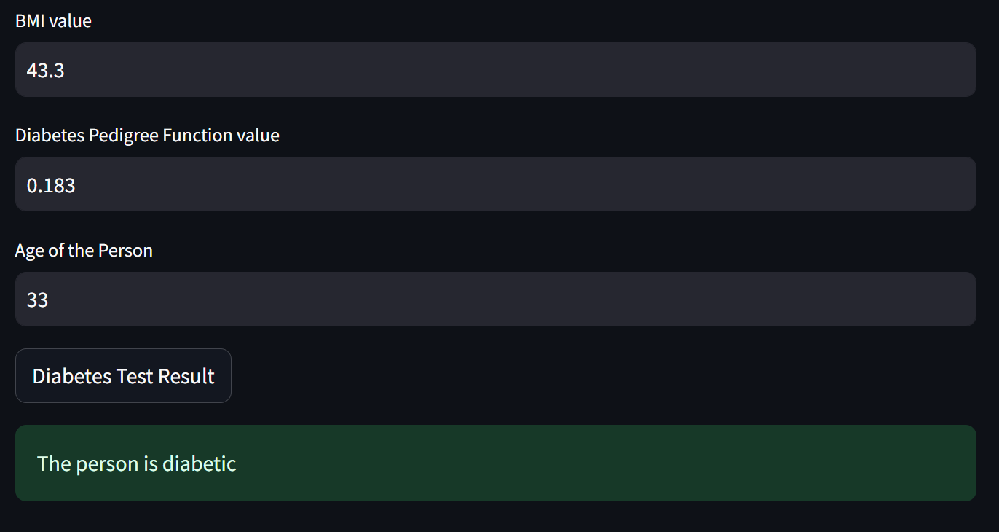

# **Diabetes Prediction Model Using SVM with Streamlit Deployment**

## **Introduction**

This repository contains the implementation of a machine learning model to predict the likelihood of diabetes based on patient data. The model uses **Support Vector Machine (SVM)** and achieves an accuracy of **72%**. The application is deployed using **Streamlit**, allowing users to input medical data and receive real-time predictions regarding their diabetes risk.

---

## **Objective**

The goals of this project are:
1. Build a machine learning model to predict diabetes using medical data.
2. Deploy the model using Streamlit, enabling user interaction via a web interface.

---

## **Dataset**

The dataset used is the **Pima Indians Diabetes Dataset**. It includes the following features:

- **Pregnancies**: Number of pregnancies
- **Glucose**: Plasma glucose concentration
- **Blood Pressure**: Diastolic blood pressure
- **Skin Thickness**: Triceps skin fold thickness
- **Insulin**: 2-Hour serum insulin level
- **BMI**: Body mass index
- **Diabetes Pedigree Function**: Diabetes risk based on family history
- **Age**: Patient's age
- **Outcome**: (1 = Diabetic, 0 = Not Diabetic)

You can download the dataset from diabetes.csv

---

## **Methodology**

### **1. Data Preprocessing**
- Handling missing or anomalous values in the dataset (e.g., replacing 0s in certain fields).
- Feature scaling using **StandardScaler** to normalize data.
- Splitting data into **training** and **testing** sets.

### **2. Model Building**
- Using **Support Vector Machine (SVM)** with an **RBF kernel** to classify patients as diabetic or non-diabetic.
- Training the model on 80% of the data and testing on 20%.
- The model achieves an accuracy of **72%** on the test data.

### **3. Model Evaluation**
- The model's performance is evaluated based on accuracy, precision, recall, and F1-score.
- Accuracy is **72%**, and further evaluations like confusion matrix provide insight into false positives and false negatives.

---

## **Streamlit Deployment**

The model is deployed using **Streamlit** to create a web-based interface where users can input relevant medical information and receive predictions in real-time. The steps for deployment are:

1. **Building the Web Interface**: A simple UI built using Streamlit allows users to enter data such as glucose levels, BMI, and age.
2. **Real-Time Predictions**: Once the data is input, the app provides a prediction on whether the user is likely to have diabetes.
3. **Deploying the App**: The app can be deployed on platforms like **Heroku** or **Streamlit Sharing** for public access.

---

## **Installation and Usage**

### **Requirements**
- Python 3.x
- Streamlit
- Scikit-learn
- Pandas
- Numpy
